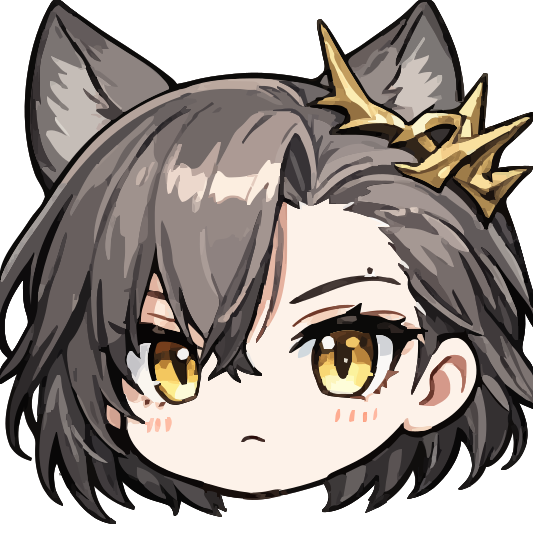

<p align="center">
  
</p>

<h1 align="center">STS2-PenanceMod</h1>

<p align="center">
  《杀戮尖塔 2》斥罪角色模组
</p>

<p align="center">
  <strong>“这一次，我会做出公正的判决。”</strong>
</p>

<p align="center">
  
  
  
  
  
</p>

## 项目简介

**STS2-PenanceMod** 是一个为《杀戮尖塔 2》制作的自定义角色模组，将《明日方舟》中的叙拉古法官 **斥罪** 带入尖塔。

与依赖格挡度过回合的传统防御型角色不同，斥罪主要通过不会在回合结束时消失的 **屏障** 构筑防线，并使用 **裁决** 让攻击者为自己的行为付出代价。

模组包含完整的角色卡池、专属遗物、药水、事件、角色皮肤与特殊挑战选项，同时针对多人联机中的角色机制和皮肤同步进行了适配。

> 本仓库主要用于保存源代码、开发记录和问题反馈。普通玩家请优先通过 Steam 创意工坊或作者发布的完整模组包安装，不建议直接下载仓库源码作为游戏模组使用。

---

## 当前内容

截至 `v0.9.99`，本模组包含：

| 内容 |   数量 | 说明                                         |
| -- | ---: | ------------------------------------------ |
| 卡牌 | 98 张 | 29 张攻击牌、40 张技能牌、19 张能力牌，以及 10 张衍生牌、诅咒牌或其他牌 |
| 遗物 | 13 件 | 10 件斥罪专属遗物和 3 件通用遗物                        |
| 事件 |  5 场 | 1 场第一层事件、3 场第二层事件和 1 场第三层事件                |
| 药水 |  3 瓶 | 2 瓶斥罪专属药水和 1 瓶通用药水                         |

此外，模组还包含：

* 多套角色皮肤及对应的战斗、死亡、篝火、商店和事件动画
* 独立的角色选择界面与挑战选项
* 多人联机角色皮肤同步
* 多人联机专属机制兼容
* 正式版与测试版游戏接口兼容
* 简体中文、英文和俄文文本

部分机制和数值仍在持续调整中。

---

## 核心机制

### 屏障

一种可以跨回合保留的特殊防御数值。

与普通格挡不同，屏障不会在回合结束时消失。斥罪可以通过持续积累屏障，建立稳定而坚固的长期防线。

### 裁决

当屏障受到来自敌人的伤害时，对攻击者造成等同于当前裁决层数的伤害。

敌人的每一次攻击，都可能成为对它自己的判决。

### 荆棘环身

回合结束时，对所有敌人造成等同于荆棘环身层数的伤害。

该机制能够提供稳定的群体输出，并与部分防御和持续作战构筑产生联动。

### 狼群诅咒

由叙拉古狼群带来的特殊诅咒。

狼群诅咒通常具有强大的正面效果，但也会附带限制、风险或不可预测的混乱。如何利用这些诅咒，是斥罪部分构筑路线的核心。

---

## 运行要求

| 项目     | 要求                    |
| ------ | --------------------- |
| 游戏     | 《杀戮尖塔 2》              |
| 最低游戏版本 | `0.107.1`             |
| 前置模组   | `BaseLib 3.4.1` 或更高版本 |
| 模组版本   | `0.9.99`              |
| 游戏分支   | Stable / Beta         |
| 开发框架   | .NET 9                |
| Godot  | Godot 4.5.1 Mono      |

本项目通过独立加载器识别当前游戏环境，并加载相应的正式版或测试版实现程序集。

---

## 玩家安装

### Steam 创意工坊

建议普通玩家通过 Steam 创意工坊订阅并安装本模组。

<!-- 发布创意工坊页面后，可以取消下一行注释并替换实际链接。 -->

<!-- [前往 Steam 创意工坊](https://steamcommunity.com/sharedfiles/filedetails/?id=WORKSHOP_ID) -->

请同时确认已经安装并启用符合版本要求的 `BaseLib`。

### 手动安装

请使用作者发布的完整模组包，不要直接将 GitHub 仓库源码复制进游戏目录。

一个完整的发布目录通常包含：

```text
PenanceMod/
├─ PenanceMod.dll
├─ PenanceMod.Stable.dll
├─ PenanceMod.Beta.dll
├─ PenanceMod.json
└─ PenanceMod.pck
```

将完整的 `PenanceMod` 文件夹放入游戏的模组目录：

```text
Slay the Spire 2/mods/
```

最终目录应类似：

```text
Slay the Spire 2/
└─ mods/
   ├─ BaseLib/
   └─ PenanceMod/
      ├─ PenanceMod.dll
      ├─ PenanceMod.Stable.dll
      ├─ PenanceMod.Beta.dll
      ├─ PenanceMod.json
      └─ PenanceMod.pck
```

---

## 从源码构建

### 开发环境

构建本项目需要：

* Git
* .NET 9 SDK
* Godot 4.5.1 Mono
* 已安装的《杀戮尖塔 2》
* 已安装的 BaseLib
* Stable 和 Beta 分支对应的 `sts2.dll` 引用文件

克隆仓库：

```bash
git clone https://github.com/Swordingman/STS2-PenanceMod.git
cd STS2-PenanceMod
```

### 配置本地路径

当前工程文件中包含开发者本机使用的游戏路径和 Godot 路径。首次构建前，需要根据自己的环境修改以下属性：

```xml
<Sts2Dir>你的游戏安装目录</Sts2Dir>
<GodotExe>你的 Godot Mono 可执行文件路径</GodotExe>
```

相关配置位于：

```text
PenanceMod.csproj
PenanceMod.Loader.csproj
```

游戏引用目录默认采用以下结构：

```text
Slay the Spire 2/
└─ mods/
   └─ References/
      ├─ Stable/
      │  └─ sts2.dll
      └─ Beta/
         └─ sts2.dll
```

`BaseLib.dll` 默认从以下位置读取：

```text
Slay the Spire 2/mods/BaseLib/BaseLib.dll
```

### 构建正式版实现

```bash
dotnet build PenanceMod.csproj -c Release -p:GameBranch=Stable
```

### 构建测试版实现

```bash
dotnet build PenanceMod.csproj -c Release -p:GameBranch=Beta
```

### 构建加载器

```bash
dotnet build PenanceMod.Loader.csproj -c Release
```

构建完成后，工程会自动将生成的文件部署至：

```text
Slay the Spire 2/mods/PenanceMod/
```

其中：

```text
PenanceMod.dll         通用加载器
PenanceMod.Stable.dll  正式版实现
PenanceMod.Beta.dll    测试版实现
PenanceMod.pck         Godot 资源包
PenanceMod.json        模组清单
```

只进行代码检查、不需要重新导出 Godot 资源包时，可以使用：

```bash
dotnet build PenanceMod.csproj -c Release -p:GameBranch=Stable -p:SkipGodotExport=true
```

---

## 项目结构

```text
STS2-PenanceMod/
├─ Loader/                    模组加载器
├─ PenanceMod/                Godot 场景、美术、音频和本地化资源
├─ PenanceModCore/            卡牌、遗物、能力、事件及其他核心逻辑
│  ├─ Cards/                  卡牌实现
│  ├─ Character/              角色与卡池定义
│  ├─ Events/                 自定义事件
│  ├─ Monsters/               自定义敌人或事件战斗
│  ├─ Networking/             多人联机同步
│  ├─ Patches/                Harmony 补丁
│  ├─ Potions/                药水实现
│  ├─ Powers/                 能力与状态
│  ├─ Relics/                 遗物实现
│  └─ Scripts/                公共脚本与数据类型
├─ build/                     Godot 导出产物
├─ PenanceMod.csproj          模组主体工程
├─ PenanceMod.Loader.csproj   加载器工程
├─ PenanceMod.json            模组清单
└─ PenanceMod.sln             Visual Studio 解决方案
```

---

## 问题反馈

发现 Bug 时，可以在本仓库提交 Issue，或者通过 Steam 创意工坊评论区反馈。

提交问题时，请尽量提供：

* 游戏版本
* 模组版本
* 当前使用 Stable 还是 Beta 分支
* 是否为多人联机
* 同时启用的其他模组
* 问题发生前的操作步骤
* 是否能够稳定复现
* 报错日志、截图或录像

也可以通过 QQ 联系作者：

```text
505392837
```

对《杀戮尖塔》模组开发或游戏交流感兴趣的玩家，可以加入杀戮尖塔 Mod 交流 QQ 群：

```text
387660497
```

作者并非该群群主。入群验证问题请填写一款由 **FimmlpS** 制作的模组。

---

## 参与开发

欢迎通过 Issue 提交 Bug、兼容性问题、文本错误和机制建议。

提交 Pull Request 前，请注意：

* 尽量保持现有代码结构与命名风格
* 将一次提交集中在一个明确问题上
* 不要提交来源不明或未经许可的美术素材
* 修改游戏机制时，请说明修改原因和预期效果
* 涉及多人联机时，请同时测试主机与客户端表现
* 涉及 Stable/Beta 差异时，请说明测试的游戏分支

大型功能建议先创建 Issue 讨论，避免投入大量工作后与项目方向冲突。

---

## 美术素材声明

本模组使用了部分来自 Pixiv、Twitter 及其他网络平台的官方作品和同人作品。

由于素材收集时间跨度较长，项目制作初期未能完整记录所有画师的名称、账号与原始出处。作者无意冒犯任何创作者，也无意将他人的劳动成果据为己有。

发现某张图片的作者或原始出处时，欢迎通过 Issue、Steam 评论区或其他联系方式告知。经确认后，作者会尽快补充对应的画师名称和来源。

如果你是相关作品的原作者，并且不希望作品被本模组使用，请直接联系作者。相关素材将被无条件替换或删除。

本模组为免费、非商业性质的粉丝创作。相关角色、世界观及官方素材版权归 **鹰角网络 Hypergryph** 所有，其他美术作品版权归各自创作者所有。

---

## 非商业声明

本模组没有任何商业用途，也没有商业化意向。

本模组应通过免费渠道获取。任何个人或组织均不得擅自将本模组或其中的内容用于售卖、付费下载、付费整合、倒卖或其他商业行为。

通过任何付费渠道获得本模组时，请停止付款并联系作者。

---

## 特别鸣谢

* **角色原型与世界观：**《明日方舟》
* **游戏本体：**《杀戮尖塔 2》
* **美术资源：** 鹰角网络及各位官方、同人画师
* **模组制作：** 花盆上屹立的不明食草兽
* **测试与反馈：** 所有参与测试、提交问题和提供建议的玩家

---

## 许可与版权

《明日方舟》及斥罪相关角色、名称、世界观和官方素材版权归鹰角网络所有。

本仓库中的第三方美术素材版权归各自创作者所有。

本仓库目前未附带独立的开源许可证。公开源代码不代表自动授予复制、再发布、商业使用或重新授权的权利。需要使用本项目代码时，请先联系作者取得许可。

---

如果这个项目对你有所帮助，欢迎留下 Star、提交反馈，并多多支持斥罪。
